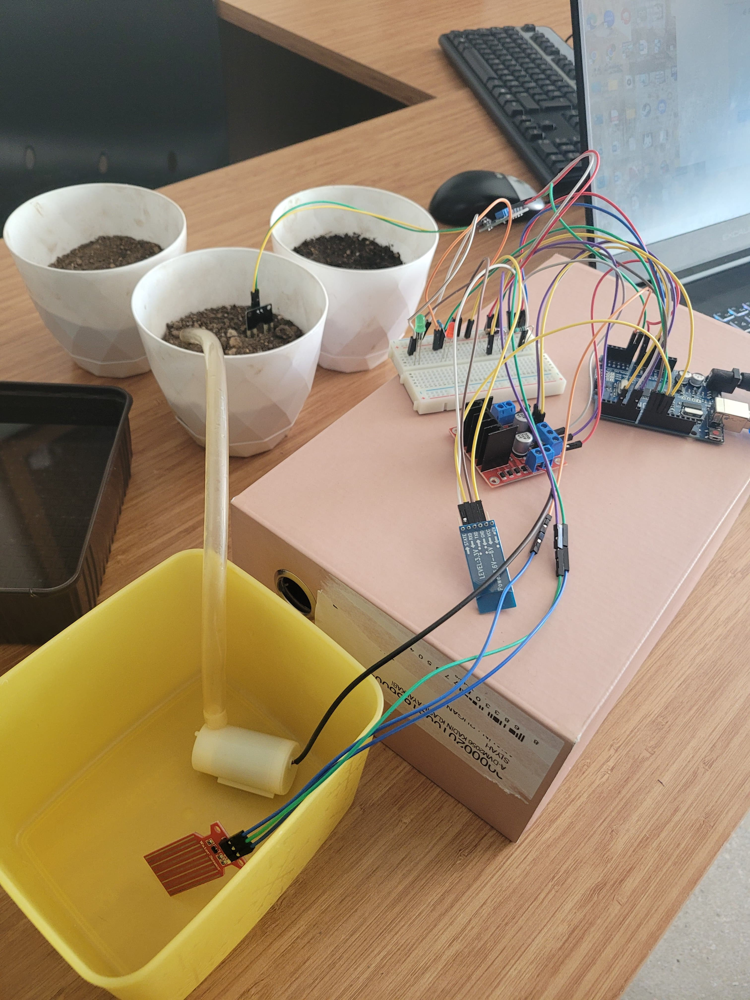
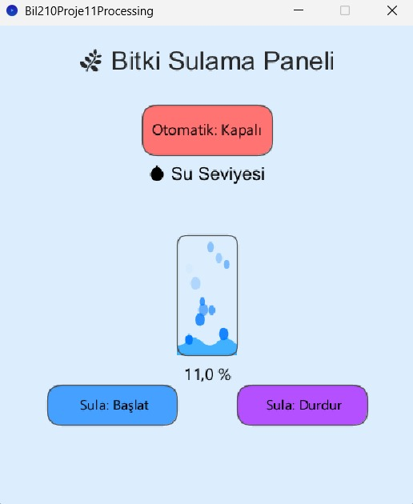
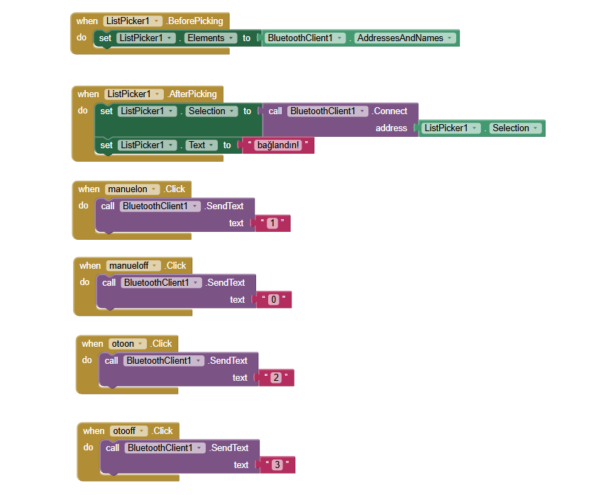
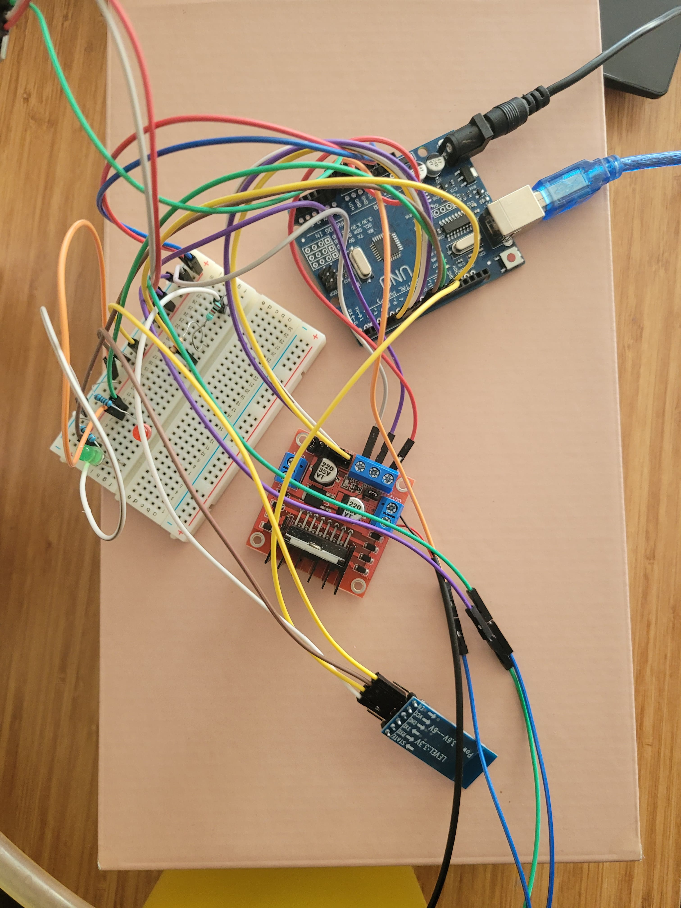
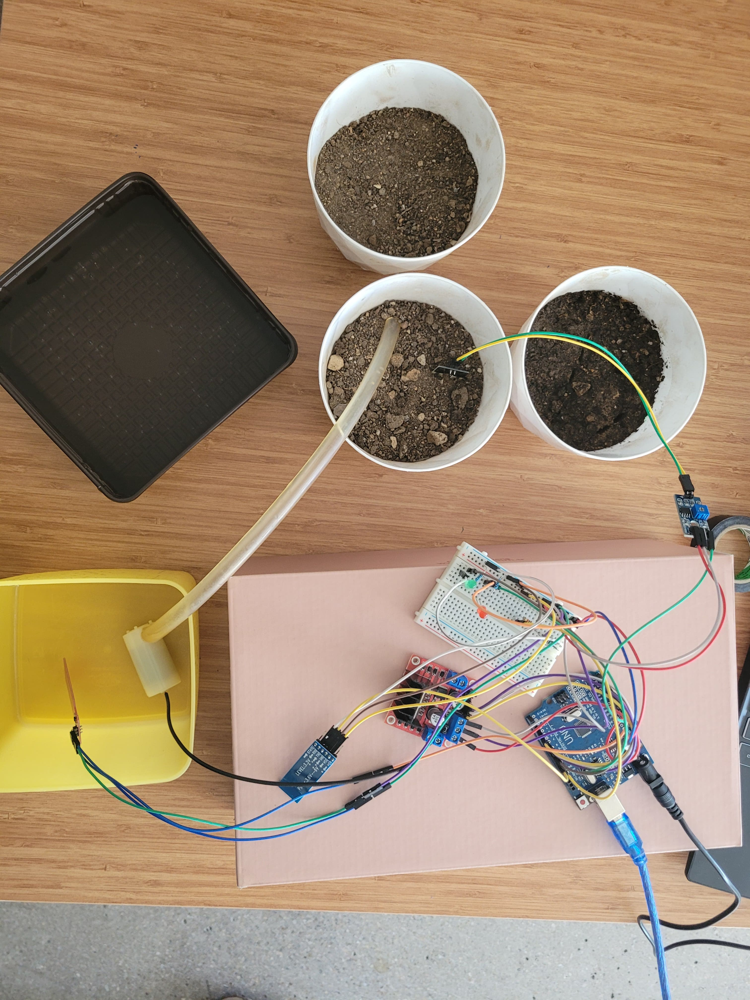
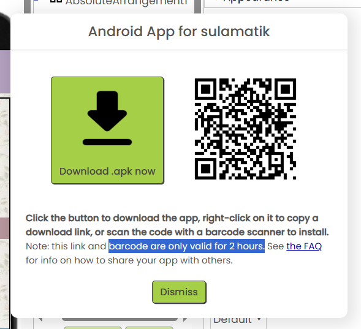

# Smart Irrigation System

An Arduino-based smart plant irrigation system that monitors soil moisture and water level. The system supports automatic watering and manual control through both a Bluetooth-enabled Android application and a Processing desktop dashboard.



## Features

- Automatic irrigation according to soil moisture
- Manual start and stop controls
- Water tank level monitoring
- Low-water warning with red and green LEDs
- Bluetooth control through an Android application
- Desktop monitoring and control with Processing
- Animated water-level visualization

## System Architecture

The Arduino reads data from the soil-moisture and water-level sensors. When automatic mode is enabled, the pump starts if the soil is dry and the water level is sufficient. Commands can also be sent from the Android application over Bluetooth or from the Processing interface over USB serial communication.

### Command Protocol

| Command | Action |
|---|---|
| `0` | Stop manual watering |
| `1` | Start manual watering |
| `2` | Enable automatic mode |
| `3` | Disable all modes and stop the pump |

Arduino sends sensor data in the following format:

```text
SU:75,OTOMATIK:1,NEM:642
```

## Hardware

- Arduino Uno
- HC-05 Bluetooth module
- Soil-moisture sensor
- Water-level sensor
- L298N motor driver
- Mini submersible water pump
- Red and green LEDs
- External power source and connection components

## Software

- Arduino IDE
- Processing
- MIT App Inventor
- Fritzing

## Repository Structure

```text
Smart-Irrigation-System/
├── arduino/          # Arduino source code
├── processing/       # Processing desktop dashboard
├── mobile-app/       # Android APK, QR code and App Inventor blocks
├── hardware/         # Fritzing circuit and prototype images
└──docs/             # Project report, presentation and task distribution
```

## Getting Started

### Arduino

1. Open `arduino/SmartIrrigationSystem/SmartIrrigationSystem.ino` in Arduino IDE.
2. Connect the components according to `hardware/Smart-Irrigation-Circuit.fzz`.
3. Select the correct Arduino board and serial port.
4. Upload the sketch.

### Processing Dashboard

1. Install Processing.
2. Open `processing/SmartIrrigationDashboard/SmartIrrigationDashboard.pde`.
3. Connect the Arduino over USB.
4. Check the serial-port list printed in the Processing console.
5. If necessary, replace `Serial.list()[0]` with the index of the Arduino port.
6. Run the sketch.

> Close Arduino Serial Monitor before starting Processing because only one application can use the serial port at a time.

### Android Application

The compiled application is available at `mobile-app/Sulamatik.apk`. Pair the Android device with the HC-05 module before using Bluetooth controls.

## Screenshots

### Processing Dashboard



### MIT App Inventor Blocks



### Prototype

| | |
|---|---|
|  |  |
|  |  |

## Team

- Beren Bakışoğlu
- Pelin Demiray
- Emine Nur Özen
- Duru Özel

## Course Information

Developed for the BİL210 course project, completed in May 2025.

## Notes

Sensor thresholds may need calibration depending on the sensor, soil type and power supply. The current automatic-watering threshold is set to a soil-moisture reading above `600`, with a required water level above `20%`.
